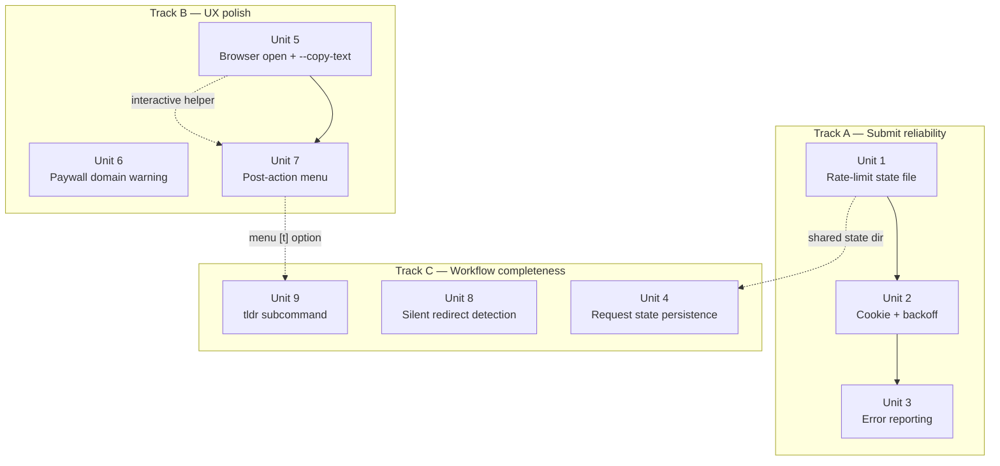

# archive-is-pp-cli Polish — Rate Limits, UX, and Workflow Improvements

**Target repo:** archive-is-pp-cli — the generated CLI at `~/printing-press/library/archive-is/`. All file paths in this plan are relative to that directory. The CLI is a standalone Go module; it is not a git repo and does not need to be for this plan to work.

## Overview

Second-pass improvements to `archive-is-pp-cli` after the initial generation and dogfood session on 2026-04-10. The CLI works — all hero commands (read, get, history, save, request, bulk) pass live tests — but the dogfood session surfaced meaningful gaps in three areas:

1. **Submit reliability.** Archive.today's per-IP rate limit on `/submit/` is easily exhausted during normal use. The CLI currently gives up on the first 429, reports misleading errors, and has no memory of the cooldown between invocations.
2. **Post-action UX.** `read <url>` prints an archive URL and silently copies to clipboard. The user has to mentally switch apps to actually read the article. The command is called "read" — it should do more.
3. **Async workflow completeness.** `request <url>` fires submit in a goroutine and returns PENDING immediately, but the goroutine's error is lost. `request check` just polls timegate forever, never telling the user that the submit actually failed.

This plan addresses all seven items from `.notes/improvements.md` plus the tl;dr LLM summarization flow Matt asked for during the session. Scope boundary: CLI-only changes. The generator-level URL-shortcut generalization (notes item 6) is tracked separately and belongs in a plan against the `cli-printing-press` repo, not this one.

## Problem Frame

Matt's primary use case is reading paywalled articles. The CLI's hero command (`read`) is optimized for that — it already does lookup-before-submit, mirror fallback, and Wayback backend fallback. But in actual use:

- Running `archive-is-pp-cli <url>` gives back a URL and nothing else. The user has to cmd-tab to a browser and paste.
- Archive.is rate-limited our IP after ~6 submit attempts during testing, and the CLI became effectively useless for an hour with confusing "https://archive.vn: rate limited" errors.
- When the CLI fell back to Wayback for a WSJ URL, the snapshot was just the paywall teaser (3 paragraphs). The user reasonably asked "why did this fail?" — but there was no warning explaining that Wayback can't strip JS and is not a good fallback for hard paywalls specifically.
- When an archive does not exist yet, the user has no clean way to say "archive this and tell me when it's ready." `request <url>` exists but the workflow is not complete — `request check` cannot distinguish "still pending" from "submit failed an hour ago".
- Some archive.is captures are silently useless because archive.is stored a DataDome bot-wall page instead of the article. The user clicks the archive URL and lands on the NYT homepage. There is no signal this happened.

Every one of these issues was observed live during the 2026-04-10 dogfood session. This plan is second-pass polish grounded in real usage, not speculation.

## Requirements Trace

- **R1.** When archive.today rate-limits the user's IP, the CLI must recognize it, remember it across invocations, and stop hammering the wall. It must surface a clear error with remediation (wait N minutes, use Wayback, submit manually via browser).
- **R2.** When `read` succeeds, the default interactive behavior must actually help the user read the article — not just print a URL.
- **R3.** When `read` falls back to Wayback for a known hard-paywall domain (WSJ, NYT, FT, Bloomberg, etc.), the CLI must warn that Wayback snapshots for those domains typically contain only the paywall teaser, and recommend `save <url>` as the path to a full capture.
- **R4.** `request <url>` must be a complete async workflow: fire-and-forget with a way to check status later, and `request check` must be able to report genuine terminal states (READY / FAILED / PENDING) rather than polling forever.
- **R5.** When an archive.today snapshot is a silent redirect to a different path (bot-wall capture → homepage), the CLI should detect it and warn the user.
- **R6.** Users must be able to pipe clean article text directly into LLMs or notes with one flag, not a composition of two commands.
- **R7.** Users must have a first-class way to summarize an archived article via an LLM (the tl;dr workflow Matt asked for during the session).
- **R8.** All of the above must degrade gracefully in non-interactive contexts (`--json`, `--quiet`, `--agent`, piped stdout, non-TTY stdin). No behavior added by this plan should break scripting or MCP tool calls.

## Scope Boundaries

- **In scope:** Changes to `internal/cli/`, `cmd/archive-is-pp-cli/main.go`, and supporting packages inside the archive-is CLI.
- **Out of scope:** Changes to the Printing Press generator (`cli-printing-press` repo). Notes item 6 (generalize the URL-shortcut pattern to the generator) is explicitly deferred to a separate plan against that repo.
- **Out of scope:** Tor onion endpoint fallback (notes 3a.4). Heavy dependency, low incremental value over cookie+backoff+cooldown state. Revisit only if the combo of units 1-3 proves insufficient in practice.
- **Out of scope:** Headless Chrome submit via chromedp (notes 3a.5). Adds ~60 MB of Chrome to the dependency tree. Revisit only if a specific user workflow demands it.
- **Out of scope:** Retroactively updating the published printing-press-library PR #37. This plan produces a second-pass CLI; whether to cut a new release is a publishing decision, not a planning decision.

## Context & Research

### Relevant Code and Patterns

- `internal/cli/read.go` — 1,072 lines. Hand-built hero commands: `read`, `get`, `history`, `save`, `request`, `bulk`. HTTP client helpers (`timegateLookup`, `submitCapture`, `waybackLookup`, `fetchMementoBody`). Text extraction (`extractReadableText`). All new units extend this file or add sibling files alongside it.
- `internal/cli/root.go` — Cobra root command registration, global flag wiring. New commands register here.
- `internal/cli/helpers.go` — Typed exit codes (`usageErr`, `notFoundErr`, `authErr`, `apiErr`, `configErr`, `rateLimitErr`). The `rateLimitErr` helper already exists and is the right exit path for unit 1's cooldown-exit case.
- `cmd/archive-is-pp-cli/main.go` — Contains the `rewriteURLShortcut` function that was added this session to make `<cli> <url>` implicitly route to `read`. Adding new top-level commands (tl;dr) requires updating the `knownCommands` map there.
- `rootFlags` struct in `root.go` — Persistent flag state (asJSON, quiet, compact, agent, etc). New interactive-mode helpers consume this struct.
- Existing `copyToClipboard` helper in `read.go` — Cross-platform (pbcopy/xclip/xsel/wl-copy/clip). `openInBrowser` helper in unit 5 follows the same pattern.

### Institutional Learnings

- **The "undefined usageErr" generator bug (resolved).** During the initial generation of this CLI, the Printing Press template gated `usageErr` emission behind `HasMultiPositional`, but promoted commands unconditionally referenced it. Fixed upstream in PR #162 (merged to `cli-printing-press` main). Not repeated here — the CLI is already building cleanly — but noted because unit 2's backoff logic uses `rateLimitErr` heavily and I want to make sure the helper is present in every future regeneration.
- **Archive.is CAPTCHA body fetches.** The initial `get` implementation did a straight HTTP fetch of the memento URL. Archive.is served a CAPTCHA page instead. The current code falls back to Wayback Machine on CAPTCHA detection. This plan extends that fallback pattern (unit 6 adds a domain-aware warning on top of the fallback).
- **The Wayback availability API.** Returns an empty snapshots map if the URL parameter is URL-encoded. Pass the URL unencoded. This was a dogfood finding and is documented in `read.go`'s `waybackLookup` comment.

### External References

- [Memento Protocol RFC 7089](https://datatracker.ietf.org/doc/html/rfc7089) — Timegate and timemap semantics. Relevant for unit 8's "silent redirect" detection, which relies on inspecting the `Location` header from a timegate response.
- [ArchiveTeam wiki on archive.today](https://wiki.archiveteam.org/index.php/Archive.today) — Documents the per-URL and per-IP throttle behavior. Basis for unit 1's 1-hour cooldown default.
- [Go `golang.org/x/term`](https://pkg.go.dev/golang.org/x/term) — Raw terminal mode for single-keystroke input, needed by unit 7's menu. Already in the Go standard ecosystem, adds one stdlib-adjacent dependency to go.mod.

## Key Technical Decisions

- **State files live in XDG-compliant paths.** Rate-limit state, request state, and any future persistent state go under `$XDG_STATE_HOME/archive-is-pp-cli/` (falling back to `~/.local/share/archive-is-pp-cli/` on systems without XDG, and `~/Library/Application Support/archive-is-pp-cli/` on macOS). Use a small helper `stateDir()` defined once in `internal/cli/state.go` and consumed by all state-file units (1, 4). Rationale: consistent path resolution prevents future units from inventing ad-hoc locations and ensures the CLI behaves on servers, CI, and non-standard home layouts.
- **Interactive mode detection is centralized.** One helper `isInteractive(flags *rootFlags) bool` lives in `internal/cli/interactive.go`. Every post-action behavior (browser open, menu, tl;dr prompt, copy confirmation) consults that helper. Rationale: consistency — the rules for "should we show a menu" should match "should we open the browser" and so on. Diverging rules is a UX bug magnet.
- **No auto-open.** Ever. The CLI never launches a browser without the user explicitly saying yes. This was an explicit user correction mid-plan: "and don't browser auto open.. offer to open in my browser wtf". The behavior is always a prompt, never a default action.
- **The prompt/menu is opt-out, not opt-in.** When the CLI detects an interactive TTY and no `--json`/`--quiet`/`--agent` flags, it shows a prompt after a successful `read`/`save`. `--no-prompt` disables it. Rationale: the 80% case is a human at a terminal who wants to read the article. The prompt should meet them where they are. Non-interactive contexts (scripts, agents, pipelines) auto-skip it.
- **The default prompt answer is "open in browser".** Pressing Enter with no letter accepts the default (open). Pressing `q` / ESC / Ctrl-C quits without opening. Rationale: Enter is affirmative, matches the user's stated intent, but the user still chose.
- **tl;dr is a first-class subcommand, not just a menu option.** `archive-is-pp-cli tldr <url>` does the full pipeline: find or create archive, fetch body, extract text, summarize via LLM. The menu's `[t]` option is a thin wrapper that invokes this subcommand. Rationale: makes the workflow scriptable (`archive-is-pp-cli tldr <url> --json` returns structured output) and keeps the menu simple.
- **LLM selection for tl;dr is environment-driven, not flag-driven.** Order of precedence: (1) `claude` CLI on PATH, (2) `ANTHROPIC_API_KEY` + direct Messages API call, (3) `OPENAI_API_KEY` + direct Chat API call, (4) graceful error "tl;dr requires an LLM — install Claude Code CLI or set ANTHROPIC_API_KEY." Rationale: Matt already has Claude Code installed; shelling out is the lowest-friction path. Direct API calls are a fallback for machines without the CLI.
- **Rate-limit cooldown defaults to 1 hour**, sourced from the `qki=` cookie's `Max-Age=3600` on 429 responses. If archive.is changes this in the future, the cookie parser reads the actual `Max-Age` and uses that. Hard-coded fallback of 3600 seconds when the cookie is absent.
- **Hard-paywall domain list is a map constant, not config.** `var hardPaywallDomains = map[string]bool{"wsj.com": true, ...}` in `internal/cli/paywall_domains.go`. Rationale: the list changes rarely; shipping updates is a rebuild. Avoid premature configurability.
- **Unit 4 (request state) uses the same state directory as unit 1 (rate-limit state).** Both units create the state dir if missing. Order of implementation does not matter; whichever lands first creates the path.

## Open Questions

### Resolved During Planning

- **Where should state files live?** XDG-compliant path via a `stateDir()` helper. See Key Technical Decisions.
- **Should the menu default to "open" or "print URL"?** Default to "open" (press Enter). Matt's use case is reading, not collecting URLs.
- **Should tl;dr be its own subcommand or just a menu action?** First-class subcommand. Menu invokes it.
- **Should the CLI detect Tor and offer it as a fallback?** Deferred. Not in scope for this plan. If rate-limit state + cookies + backoff + domain warning + browser handoff prove insufficient in practice, revisit with a focused Tor-support plan.
- **Should we include a domain-blocklist for Wayback (e.g., never fall through to Wayback for wsj.com even if archive.is fails)?** No. The Wayback snapshot, even a teaser, is still better than no result. Warn loudly (unit 6), but don't remove the fallback.

### Deferred to Implementation

- **Exact menu keystroke handling on Windows.** The `golang.org/x/term` package handles raw mode on Windows but the specific keystroke encodings (arrow keys, etc.) may need platform testing. Decision deferred until unit 7 implementation; worst case the Windows build shows a numbered menu with Enter confirmation instead of single-keystroke mode.
- **Memento HEAD redirect semantics for unit 8.** Archive.is's resolver may or may not 302-redirect when the stored snapshot is a bot-wall page. Needs a probe at implementation time to confirm whether HEAD is enough or we need to fetch the body and check the extracted content. Three candidate heuristics listed in the unit; pick the one that empirically works.
- **LLM prompt wording for tl;dr.** A good 3-bullet prompt is empirical work; starting point is "Summarize this article in 3 bullet points and 1 headline" but iteration during implementation is expected.
- **Desktop notification libraries.** `terminal-notifier` on macOS, `notify-send` on Linux — are these installed by default? Probably not on Linux. Degrade to terminal bell + final line of stderr if notification tools are absent.

## High-Level Technical Design

The plan has three natural "tracks" that can ship in any order (with dependency constraints noted per unit). A reader can validate the shape with this one diagram:



*This illustrates the intended approach and is directional guidance for review, not implementation specification. The implementing agent should treat it as context, not code to reproduce.*

Dotted lines are soft dependencies — the later unit uses a helper the earlier unit introduces, but the dependency is shallow and a well-chosen stub could break it. Solid lines are hard dependencies.

## Implementation Units

- [ ] **Unit 1: Rate-limit state file and cooldown detection**

**Goal:** Persist the archive.today submit rate-limit across CLI invocations so the CLI stops hammering the wall after one 429. Before any submit, check if we are in a known cooldown window; if so, surface a clear error with time-remaining rather than making the request.

**Requirements:** R1

**Dependencies:** None. Foundational.

**Files:**
- Create: `internal/cli/state.go` — shared `stateDir()` helper for all persistent CLI state.
- Create: `internal/cli/rate_limit.go` — `readCooldown()`, `writeCooldown()`, `isInCooldown()`, `cooldownRemaining()`.
- Modify: `internal/cli/read.go` — `submitCapture()` consults the cooldown state before issuing requests and writes cooldown on 429.
- Test: `internal/cli/rate_limit_test.go`.

**Approach:**
- `stateDir()` resolves to the first of: `$XDG_STATE_HOME/archive-is-pp-cli/`, `$HOME/Library/Application Support/archive-is-pp-cli/` on macOS, `$HOME/.local/share/archive-is-pp-cli/` elsewhere. Creates the directory if missing.
- Rate-limit state is a single JSON file at `<stateDir>/rate-limit.json` with fields `last_429_at` (RFC3339), `cooldown_until` (RFC3339). Missing file means no cooldown.
- On 429 response, parse the `qki=` cookie's `Max-Age` attribute; if missing, use 3600 seconds. Write `cooldown_until = now + Max-Age`.
- `submitCapture()` calls `isInCooldown()` before iterating mirrors. If in cooldown, returns immediately with a structured error that callers in unit 3 can format nicely.
- State file is user-readable; document the location in the README's troubleshooting section.

**Patterns to follow:**
- Existing `dbPath()` style in `internal/mcp/tools.go.tmpl` for consistent state-location logic.
- Existing `cliError` struct in `internal/cli/helpers.go` for typed errors. Extend with a `CooldownError` variant or carry the cooldown info in a new error wrapper.

**Test scenarios:**
- Happy path: no state file exists, `isInCooldown()` returns false, submit proceeds normally.
- Happy path: state file says cooldown_until is in the past, `isInCooldown()` returns false, submit proceeds.
- Happy path: state file says cooldown_until is 30 minutes in the future, `isInCooldown()` returns true with `cooldownRemaining() == 30m`.
- Edge case: state file exists but is malformed JSON — treat as no cooldown (self-heal) and overwrite on next 429.
- Edge case: state directory is unwritable (permissions) — log a warning to stderr and proceed without persistence rather than crashing.
- Error path: 429 response with no `qki=` cookie — write cooldown with fallback 3600s and log that the cookie was missing.
- Error path: 429 response with malformed `qki=` cookie Max-Age — same fallback, log the malformed value.
- Integration: run `save` twice in a row when the first call triggers a simulated 429; second call should short-circuit with the cooldown error without making an HTTP request.

**Verification:**
- After a 429 response, `cat <stateDir>/rate-limit.json` shows a valid `cooldown_until` timestamp.
- A subsequent `save` call within the cooldown window returns the cooldown error in under 50 ms (no HTTP request).
- The cooldown error message includes the number of minutes remaining and a suggestion to wait or use browser handoff.

---

- [ ] **Unit 2: Cookie preservation and exponential backoff on submit**

**Goal:** Reduce spurious 429s by behaving more like a real browser (preserve qki cookie across requests) and handling transient rate-limits with retry (exponential backoff with jitter). Does NOT try to defeat archive.is's rate limiting — only smooths over it.

**Requirements:** R1

**Dependencies:** Unit 1 (writes cooldown state when backoff is exhausted).

**Files:**
- Modify: `internal/cli/read.go` — `submitCapture()` and `timegateLookup()` preserve cookies across mirror attempts and run a bounded retry loop.
- Create: `internal/cli/http_client.go` — shared `newArchiveHTTPClient()` factory that returns an HTTP client with a cookie jar and the standard User-Agent. All archive-is-touching HTTP calls move to use this factory.
- Test: `internal/cli/http_client_test.go`.

**Approach:**
- Create one `http.Client` per CLI invocation with `net/http/cookiejar` attached. Visit `archive.ph/` once at the start of any submit flow to acquire the qki cookie (if not already present). Subsequent submits include the cookie automatically via the jar.
- Backoff schedule on 429: 5 seconds, 15 seconds, 60 seconds, then give up and write cooldown state (unit 1). Jitter the delays by ±25% to avoid thundering-herd behavior if the user runs multiple invocations.
- Backoff applies per submit attempt, not per mirror. Do not mirror-cycle on 429 — all mirrors share the same backend rate limit, so rotating is pointless and wastes quota.
- The backoff loop is interruptible via context cancellation (Ctrl-C).

**Patterns to follow:**
- Existing `newNoRedirectClient()` in `read.go` — extend it to accept a cookie jar.
- Existing mirror iteration in `submitCapture()` — keep mirror fallback for non-429 errors (network, DNS) but not for 429.

**Test scenarios:**
- Happy path: submit returns 200 on first attempt, no backoff triggered, cookie stored in jar.
- Happy path: submit returns 429 once then 200, single 5-second backoff, final result is the successful memento.
- Edge case: cookie jar returns no cookie from `/` visit (archive.is behavior change) — proceed without cookies, log at debug level, do not fail.
- Edge case: backoff loop interrupted by Ctrl-C — return cleanly with an interrupted-by-user error, do not write cooldown state (user-initiated abort is not a rate limit).
- Error path: all three backoff attempts return 429 — give up, write cooldown state to unit 1's file, return a rate-limit error that unit 3 can format.
- Error path: network failure (DNS, connection refused) during backoff — fall through to next mirror, do not count the failure against backoff budget.
- Integration: a submit-then-submit sequence where the first call triggers backoff-and-cooldown. Second call hits the cooldown short-circuit from unit 1 and never makes an HTTP request.

**Verification:**
- After a successful submit that included one 429 + one retry, the cookie jar contains a `qki` entry and the total wall time is ~5-7 seconds.
- After three consecutive 429s, the state file has a cooldown_until roughly 1 hour in the future and the error message reflects that.

---

- [ ] **Unit 3: Better error reporting for submit failures**

**Goal:** Replace the misleading `submit failed: https://archive.vn: rate limited` message with a structured multi-line report that shows every mirror's status and provides concrete remediation guidance.

**Requirements:** R1

**Dependencies:** Unit 2 (needs the full error list from the retry loop).

**Files:**
- Modify: `internal/cli/read.go` — `submitCapture()` collects per-mirror results and returns a structured error type that formats cleanly.
- Modify: `internal/cli/helpers.go` — extend error formatting to handle the new error type.
- Test: `internal/cli/read_test.go` — add test cases asserting the rendered error contains each mirror line and remediation text.

**Approach:**
- Define a new `SubmitFailureError` type with fields `MirrorAttempts []MirrorResult`, `Cooldown *time.Duration`, `Suggestion string`.
- Each `MirrorResult` has `URL string`, `HTTPCode int`, `Err error`.
- When rendered with `Error()`, produces:
  ```
  submit failed: archive.today rate-limited this IP
    archive.ph:  HTTP 429
    archive.md:  HTTP 429
    archive.is:  HTTP 429
    archive.fo:  HTTP 429
    archive.li:  HTTP 429
    archive.vn:  HTTP 429

  Cooldown: retry in 58 minutes.
  Alternative: submit manually at https://archive.ph/ in your browser.
  ```
- When `--json` is set, serialize the structured error as JSON to stderr instead of the plain-text render.
- `rateLimitErr()` exit code (7) applies; existing typed exit code flow is unchanged.

**Patterns to follow:**
- Existing `APIError` struct in `internal/client/client.go` — mirrors the "structured error that formats well" pattern.

**Test scenarios:**
- Happy path: three mirrors fail with different 5xx codes — rendered output lists all three with their codes, no cooldown section.
- Happy path: all six mirrors return 429 and cooldown is set — rendered output lists all six and shows the cooldown remaining.
- Edge case: one mirror fails with network error (not HTTP) — rendered output shows "network error" with the underlying Go error message.
- Edge case: `--json` flag set — error is JSON on stderr, stdout is empty, exit code is 7.
- Edge case: `--quiet` flag set — only the first line ("submit failed: ...") goes to stderr, no per-mirror detail.
- Integration: the rate-limit cooldown error from unit 1 flows through the same formatter, showing the cooldown without the per-mirror detail (because no HTTP was attempted).

**Verification:**
- Running `save <url>` against a simulated all-429 mirror set produces the multi-line structured error with all six mirror lines.
- Running the same command with `--json` produces valid JSON on stderr and empty stdout.
- Exit code is 7 (`rateLimitErr`) in both cases.

---

- [ ] **Unit 4: Request state persistence for async submits**

**Goal:** Complete the `request` / `request check` async workflow. Make `request check` able to report the terminal state of an async submit — READY, FAILED, or genuinely PENDING — by persisting the goroutine's result to disk.

**Requirements:** R4

**Dependencies:** Unit 1 (uses the same `stateDir()` helper).

**Files:**
- Create: `internal/cli/request_state.go` — `RequestRecord` type, `readRequestState()`, `writeRequestState()`, `GCOldRequests()`.
- Modify: `internal/cli/read.go` — `newRequestCmd()` writes state on goroutine completion; `request check` reads state before polling timegate.
- Test: `internal/cli/request_state_test.go`.

**Approach:**
- State file: `<stateDir>/requests.json`. Top-level object keyed by original URL; each entry has `submitted_at`, `status` (pending/ready/failed), `error` (for failed), `memento_url` (for ready), `completed_at`.
- `request <url>` (without --wait) writes a `pending` entry immediately and spawns a goroutine that will update the entry on completion. Goroutine is detached — parent returns immediately.
- Since the parent process exits before the goroutine finishes, the "goroutine" must actually be a spawned child process: `archive-is-pp-cli request __worker <url>` invoked with `Setsid(true)` so it survives the parent's exit.
- The `__worker` subcommand is hidden from help, does the actual submit work, and writes the final state on completion.
- `request check <url>` first reads the state file. If present and non-pending, report the terminal state (READY with memento_url, or FAILED with the error). If pending or missing, fall back to the current behavior (poll timegate).
- `GCOldRequests()` runs once per `request` invocation and drops records older than 7 days to prevent unbounded file growth.

**Patterns to follow:**
- Existing async goroutine pattern in `newRequestCmd()` — replace with child-process spawn for durability.
- Typed exit codes for different terminal states (READY=0, FAILED=5, PENDING=0 with warning).

**Test scenarios:**
- Happy path: `request <url>` writes a pending record and returns immediately. A few seconds later, the worker updates the record to ready. `request check <url>` reads the ready state and prints the memento URL.
- Happy path: `request <url> --wait` does not use the detached worker — runs synchronously (existing behavior) but still writes the final state so a subsequent `request check` knows about it.
- Edge case: state file missing when `request check` runs — falls back to polling timegate (existing behavior).
- Edge case: record exists but status is "pending" and the worker is dead (parent killed it, or reboot) — after 5 minutes with no update, `request check` notes the staleness and re-polls timegate.
- Edge case: two `request` invocations on the same URL in quick succession — second invocation sees the pending record and skips spawning a new worker, just prints "already pending, check with `request check <url>`".
- Error path: worker process crashes before writing state — stale pending entry. GC cleanup after 7 days, but interim `request check` should detect staleness via the 5-minute heuristic above.
- Error path: state file unwritable — fall back to in-memory goroutine (existing behavior), print a warning to stderr.
- Integration: full flow against the live archive.today — submit, detach, 60 seconds later `request check` reports READY with the actual memento URL.

**Verification:**
- After `request <url>` returns, `<stateDir>/requests.json` contains a pending entry for the URL.
- After the worker completes, the entry status is ready with a populated memento_url.
- `request check <url>` reads the file and prints the terminal state without making a network request.
- GC drops entries older than 7 days on subsequent runs.

---

- [ ] **Unit 5: Interactive-mode helpers, open-browser prompt, and `--copy-text` flag**

**Goal:** After `read`, `save`, or `request --wait` completes successfully in an interactive terminal, show a prompt: "Open in browser? [Y/n/q]". Do NOT auto-open. The user always decides. Also add `--copy-text` to put extracted article text in the clipboard instead of the URL.

**Requirements:** R2, R6, R8

**Dependencies:** None. Independent of all other units.

**Files:**
- Create: `internal/cli/interactive.go` — `isInteractive(flags *rootFlags) bool`, `openInBrowser(url string) error`, `promptYesNo(prompt string, defaultYes bool) (bool, error)`.
- Modify: `internal/cli/read.go` — `newReadCmd()`, `newSaveCmd()`, `newRequestCmd()` invoke `promptYesNo()` on success in interactive mode. `read` also gets a `--copy-text` flag.
- Test: `internal/cli/interactive_test.go`.

**Approach:**
- `isInteractive(flags)` returns false if any of `flags.asJSON`, `flags.quiet`, `flags.agent` is set. Otherwise checks if `os.Stdin` AND `os.Stdout` are both TTYs (via `golang.org/x/term.IsTerminal(int(fd))`). Also returns false if `--no-prompt` is set on the specific command.
- `openInBrowser(url)` cross-platform: `open` on macOS, `xdg-open` on Linux, `cmd /c start` on Windows. Non-blocking — use `cmd.Start()` not `cmd.Run()`.
- `promptYesNo(prompt, defaultYes)` renders a prompt to stderr like `Open in browser? [Y/n/q]`. Reads a single keystroke via `golang.org/x/term.MakeRaw()` on stdin. Restores terminal state on return.
  - `y` / Enter (when defaultYes) → return true
  - `n` → return false
  - `q` / ESC / Ctrl-C → return false (same as no, but signals explicit cancel)
  - Echoes the chosen letter on its own line so the user sees what they picked
- Add `--no-prompt` flag to `read`, `save`, and `request --wait`. When set, prints result and exits without asking. Scripts and agents use this.
- Status line after a successful `read` in interactive mode (default path when user says yes):
  ```
  https://archive.md/...
    captured 2026-04-10 22:15:19 via archive.ph
    copied to clipboard

  Open in browser? [Y/n/q]
  > y
  opening in browser...
  ```
- When the user says no/quit, the CLI exits cleanly without opening. The URL is still on stdout and clipboard.
- Add `--copy-text` flag to `read`. When set, the CLI internally runs the `get` logic to extract text and copies THAT to the clipboard instead of the URL. The URL still prints to stdout. The prompt still shows (you can answer no and still have the text in your clipboard).
- Do NOT apply the prompt to `get` (stdout is the payload), `history` (multi-result), `bulk` (would prompt N times), `request` without --wait (completes later).
- This unit ships the SIMPLE yes/no prompt. Unit 7 later extends it to a richer menu with [o]/[t]/[r]/[q].

**Patterns to follow:**
- Existing `copyToClipboard()` in `read.go` — same `exec.Command` shape for `openInBrowser()`.
- Existing `rootFlags` struct — add a `noPrompt` field that commands can set on their own flags.

**Test scenarios:**
- Happy path: `read <url>` in interactive mode prints URL + clipboard, shows prompt, user presses `y` or Enter, browser opens. Command exits with 0.
- Happy path: `read <url>` in interactive mode, user presses `n`, command exits 0 without opening. URL is still on stdout and clipboard.
- Happy path: `read <url>` in interactive mode, user presses ESC, same as `n`.
- Happy path: `read <url> --json` — `isInteractive()` returns false, no prompt, no browser open.
- Happy path: `read <url> --no-prompt` — prints URL + clipboard, no prompt, no browser open.
- Happy path: `read <url> --copy-text` — fetches body, extracts text, copies text to clipboard; URL still prints to stdout; prompt still shows.
- Edge case: stdout is piped (`read <url> | cat`) — `isInteractive()` returns false, no prompt.
- Edge case: stdin is not a TTY (piped input or redirected) — `isInteractive()` returns false, no prompt.
- Edge case: `pbcopy` / `xdg-open` not on PATH — `openInBrowser()` returns an error but the command overall still succeeds (print the URL, note the open failure on stderr).
- Edge case: `--agent` flag — no prompt, no browser, no status lines beyond the URL (agent-native output).
- Edge case: terminal raw-mode fails (unusual environment) — fall back to line-mode prompt that requires Enter (`read stdin until newline`).
- Integration: full `read <real url>` run in a real terminal, confirming prompt shows, responds to keystrokes, and opens the browser only on `y`/Enter.

**Verification:**
- Running `archive-is-pp-cli read https://example.com` in a terminal shows a prompt and does NOT open the browser until the user says yes.
- Pressing Enter at the prompt opens the browser.
- Pressing `n` exits cleanly without opening.
- Running the same command with `| cat` shows no prompt and does not open the browser.
- Running with `--copy-text` puts the extracted article text in the clipboard (verified by `pbpaste | head`).

---

- [ ] **Unit 6: Hard-paywall domain warning when Wayback is used as fallback**

**Goal:** When the CLI falls back to Wayback Machine for a URL on a known hard-paywall domain (WSJ, NYT, FT, etc.), warn the user that Wayback snapshots for those domains usually contain only the paywall teaser, and recommend `save <url>` as the path to a full archive.today capture.

**Requirements:** R3

**Dependencies:** None. Independent.

**Files:**
- Create: `internal/cli/paywall_domains.go` — `var hardPaywallDomains map[string]bool` and `isHardPaywallDomain(u string) bool`.
- Modify: `internal/cli/read.go` — `newReadCmd()` and `newGetCmd()` emit the warning when falling through to Wayback for a hard-paywall URL.
- Test: `internal/cli/paywall_domains_test.go`.

**Approach:**
- `hardPaywallDomains` is a map of registerable domains (suffix match, so `wsj.com` matches `www.wsj.com` and `markets.wsj.com`). Populated with: wsj.com, nytimes.com, ft.com, bloomberg.com, economist.com, theatlantic.com, newyorker.com, washingtonpost.com, wapo.st, businessinsider.com, barrons.com, marketwatch.com, foreignaffairs.com, hbr.org.
- `isHardPaywallDomain(u string)` uses `net/url.Parse` + suffix match against the Host field.
- In `read` and `get`, when the archive.is path fails and we fall through to Wayback, check `isHardPaywallDomain(origURL)`. If true, print a warning to stderr before the result:
  ```
  Note: Wayback snapshots of WSJ articles usually show only the paywall teaser.
  For full article text, try:
    archive-is-pp-cli save <url>
  This forces a fresh archive.today capture which strips JavaScript and bypasses the paywall overlay.
  ```
- Respect `--quiet` and `--json` — no warning in those modes.

**Patterns to follow:**
- Existing `extractMirror()` in `read.go` for URL parsing.

**Test scenarios:**
- Happy path: `isHardPaywallDomain("https://www.wsj.com/articles/abc")` returns true.
- Happy path: `isHardPaywallDomain("https://example.com/article")` returns false.
- Edge case: hostname without subdomain (`https://wsj.com/article`) — matches.
- Edge case: unrelated subdomain with suffix collision (`https://notwsj.com/article`) — does NOT match (suffix match must align on a label boundary).
- Edge case: URL with no scheme — parse failure, returns false (do not warn on invalid input).
- Integration: `read https://www.wsj.com/...` where archive.is fails and Wayback succeeds — warning appears on stderr before the URL.
- Integration: `read https://example.com/...` where archive.is fails and Wayback succeeds — warning does NOT appear.
- Integration: `read https://www.wsj.com/... --quiet` — warning does NOT appear.

**Verification:**
- Running `read` on a WSJ URL where archive.is is down (or the URL has no snapshot) produces the warning.
- Running the same on a non-paywall domain (example.com) produces no warning.

---

- [ ] **Unit 7: Extend the open-browser prompt into a richer multi-option menu**

**Goal:** Build on Unit 5's yes/no prompt to offer a richer set of actions after a successful `read`/`save`: open in browser (default), tl;dr via LLM, read full text here, quit. Replaces Unit 5's `promptYesNo` with a `promptMenu` that supports multiple single-keystroke options.

**Requirements:** R2, R7, R8

**Dependencies:** Unit 5 (extends `isInteractive()` and the terminal raw-mode pattern). Unit 9 (menu `[t]` option invokes the tldr subcommand).

**Files:**
- Create: `internal/cli/menu.go` — `type menuOption`, `promptMenu(stderr io.Writer, options []menuOption, defaultKey rune) (rune, error)`.
- Modify: `internal/cli/read.go` — `newReadCmd()`, `newSaveCmd()`, `newRequestCmd()` call `promptMenu()` after successful completion in interactive mode.
- Modify: `cmd/archive-is-pp-cli/main.go` — add `tldr` to the `knownCommands` map (for the URL shortcut guard).
- Test: `internal/cli/menu_test.go` — mock the terminal reader to simulate keystrokes.

**Approach:**
- Menu renders to stderr (stdout stays clean for piping, although the menu itself implies interactive mode so piping is unlikely).
- `promptMenu()` uses `golang.org/x/term.MakeRaw()` on stdin to read a single keystroke without requiring Enter. Restores terminal state on return (deferred).
- Single keystroke maps to an action. Enter activates the default option. ESC or Ctrl-C cancels (returns with `errInterrupted`).
- Menu options per command:
  - After `read` / `save` success: `[o] open in browser (default)`, `[t] tl;dr — summarize with Claude`, `[r] read full text here`, `[q] quit`
  - After `request --wait` success: same as read
  - No menu after `get`, `history`, `bulk`, `request` without --wait
- Actions:
  - `[o]` → `openInBrowser(memento_url)` (already set up by unit 5)
  - `[t]` → invoke `tldr <url>` logic from unit 9 against the original URL
  - `[r]` → invoke `get <url>` logic to fetch and print extracted text to stdout
  - `[q]` / ESC / Ctrl-C → return without further action
- Flags: `--no-menu` (force no menu even interactive), `--menu` (force menu), `--action <key>` (pre-select, skip menu — useful for scripts and LLM-driven invocations).
- Menu is skipped automatically when any of `--json`, `--quiet`, `--agent`, `--no-open`, or non-TTY is true. `--no-open` implies `--no-menu` for symmetry.

**Technical design:** *(directional — not implementation spec)*

```
After successful read:
  PrintResult()                  // existing URL + metadata
  if isInteractive() && !flags.noMenu {
    key := promptMenu(stderr, []menuOption{
      {'o', "open in browser", doOpen},
      {'t', "tl;dr — summarize", doTldr},
      {'r', "read full text here", doRead},
      {'q', "quit", nil},
    }, 'o')
    switch key {
    case 'o', '\r': doOpen()
    case 't':       doTldr()
    case 'r':       doRead()
    }
  }
```

**Patterns to follow:**
- No existing in-repo raw-mode terminal patterns. `golang.org/x/term` is the standard library adjacent to stdlib.
- `copyToClipboard()` style for cross-platform fallback — if raw mode fails on a specific platform, degrade to numbered-menu + Enter.

**Test scenarios:**
- Happy path: menu shows, user presses `o`, `openInBrowser()` is called with the memento URL.
- Happy path: menu shows, user presses Enter (no key), default `o` action fires.
- Happy path: user presses `t`, tldr subcommand logic runs and prints the summary, then menu redisplays (optionally loop to allow chaining).
- Happy path: user presses `r`, full text is printed to stdout, command exits.
- Happy path: user presses `q`, command exits without action, exit code 0.
- Edge case: user presses ESC, treated as `q`.
- Edge case: user presses Ctrl-C, terminal state restored, exit code 130 (interrupted).
- Edge case: `--json` set — menu is skipped entirely, no menu prompt printed.
- Edge case: `--action open` set — menu is skipped, `openInBrowser()` runs directly.
- Edge case: stdin is not a TTY (piped from another command) — `MakeRaw()` fails, menu is skipped, command exits as if `--no-menu` were set.
- Edge case: terminal does not support raw mode (rare, mostly Windows consoles) — fall back to numbered menu prompt that requires Enter.
- Error path: `promptMenu()` returns an error — print the result URL as today and exit cleanly, do not crash.
- Integration: full read → menu → `t` → tldr → summary printed. Uses real stdin with expect-style mock.

**Verification:**
- Running `read <url>` in a terminal shows the menu and responds to single keystrokes without requiring Enter.
- Running the same command with `--json` does not show a menu.
- The default action on Enter opens the browser.

---

- [ ] **Unit 8: Detect silent redirect to homepage (bot-wall captures)**

**Goal:** When `read` returns an archive.today snapshot, detect cases where archive.is's resolver is silently serving a redirect to a different path (typically the site homepage) because the originally stored snapshot was a bot-wall capture. Warn the user and recommend `save <url> --force`.

**Requirements:** R5

**Dependencies:** None. Independent. Can ship last.

**Files:**
- Modify: `internal/cli/read.go` — `newReadCmd()` performs a HEAD follow-up after timegate returns.
- Test: `internal/cli/read_test.go`.

**Approach:**
- After `timegateLookup()` returns a memento URL, issue a HEAD request to that URL with redirect-following enabled.
- Extract the final URL after all redirects. Compare the path to the original URL's path.
- If the final path differs AND the final path is the site root (`/`) or a shorter parent of the requested path, treat it as a silent redirect. Print a warning:
  ```
  Note: archive.today has a snapshot for this URL but it was served as a redirect to the homepage.
  This usually means the original capture hit a bot wall (e.g., DataDome).
  Try a fresh capture: archive-is-pp-cli save <url> --force
  ```
- Do not fail — the user may still want to see the homepage snapshot. Continue with the current behavior.
- Respect `--quiet` and `--json`.
- Two candidate heuristics documented in Open Questions; pick the one that works empirically during implementation. Starting point: "path differs AND final path has fewer segments than the original path".

**Patterns to follow:**
- Existing `fetchMementoBody()` for HTTP requests to memento URLs — but use HEAD instead of GET to avoid downloading the body.

**Test scenarios:**
- Happy path: memento URL resolves to the same path as requested — no warning.
- Happy path: memento URL resolves to the site root — warning appears.
- Edge case: memento URL is archive.is's "Please complete the security check" CAPTCHA page — falls back to Wayback as before (unit 5's existing behavior), no warning from this unit.
- Edge case: HEAD request fails (network, 500) — proceed without the warning, do not fail the overall command.
- Edge case: `--quiet` set — no warning printed.
- Edge case: final path differs but is longer than requested (sub-page of requested) — no warning (this is a forward navigation, not a bot wall).
- Integration: live test against a known-bot-walled URL (e.g., an NYT article captured during a DataDome block) — warning appears.
- Integration: live test against a normal captured article — no warning.

**Verification:**
- Running `read` on a URL known to have a bot-wall capture emits the warning.
- Running `read` on a normal URL does not emit the warning.
- HEAD requests add no more than 500 ms to the command latency.

---

- [ ] **Unit 9: `tldr` subcommand for LLM summarization**

**Goal:** Add a first-class `tldr` subcommand that does the full pipeline: find or create an archive, fetch the body, extract text, summarize via LLM, print the summary. Makes Matt's "tl;dr it here" flow concrete and scriptable.

**Requirements:** R7

**Dependencies:** None for standalone command. Unit 7's menu `[t]` option invokes this subcommand's logic.

**Files:**
- Create: `internal/cli/tldr.go` — `newTldrCmd()`, `runTldr()` (extracted so unit 7 can call it directly).
- Create: `internal/cli/llm.go` — `llmSummarize(text string) (string, error)` with provider detection.
- Modify: `internal/cli/root.go` — register `newTldrCmd()`.
- Modify: `cmd/archive-is-pp-cli/main.go` — add `tldr` to `knownCommands` map.
- Test: `internal/cli/tldr_test.go`, `internal/cli/llm_test.go`.

**Approach:**
- Command: `archive-is-pp-cli tldr <url> [--backend ...] [--json]`.
- Pipeline:
  1. Run `read` logic to find or create the archive (reuse `timegateLookup` + `submitCapture` + Wayback fallback).
  2. Run `get` logic to fetch the memento body and extract readable text (reuse `fetchMementoBody` + `extractReadableText`).
  3. Pass the extracted text to `llmSummarize()`.
  4. Print the summary.
- `llmSummarize()` provider detection (checked in order):
  1. `claude` binary on PATH → shell out with `claude --print "Summarize this article in 3 bullet points and 1 headline:\n\n<text>"`. Preferred because Matt has Claude Code installed.
  2. `ANTHROPIC_API_KEY` env var → direct HTTPS call to `https://api.anthropic.com/v1/messages` with model `claude-haiku-4-5` (fast, cheap, sufficient for summaries).
  3. `OPENAI_API_KEY` env var → direct HTTPS call to `https://api.openai.com/v1/chat/completions` with model `gpt-4o-mini`.
  4. None of the above → clear error: "tl;dr requires an LLM. Install Claude Code CLI, or set ANTHROPIC_API_KEY or OPENAI_API_KEY."
- The prompt is a constant but easy to tune: `"Summarize this article in 3 bullet points and 1 headline.\n\nArticle:\n\n%s"`
- `--json` output shape: `{"url": "...", "memento_url": "...", "headline": "...", "bullets": ["...", "...", "..."], "backend": "archive-is"}`.
- Graceful fallback: if the text is too long for the chosen model, truncate to the first N characters (provider-specific limits; start with 16k chars) and note the truncation in the summary.
- Unit 7's menu `[t]` option calls `runTldr()` directly rather than shelling back into the CLI.

**Patterns to follow:**
- `extractReadableText()` in `read.go` for text extraction.
- `copyToClipboard()` for cross-platform binary detection (`exec.LookPath("claude")`).

**Test scenarios:**
- Happy path: `tldr <url>` with `claude` on PATH — full pipeline succeeds, 3-bullet summary printed.
- Happy path: `tldr <url>` with `ANTHROPIC_API_KEY` set and no `claude` binary — direct API call, summary printed.
- Happy path: `tldr <url> --json` — returns structured JSON with bullets, headline, and URLs.
- Edge case: archive not found and cannot be created (rate-limited) — reports the error from unit 3's formatter, does not attempt LLM call.
- Edge case: text extraction returns very short content (< 200 chars) — skip LLM, print a note that the article body could not be extracted.
- Edge case: text exceeds model context — truncate to 16k chars, note truncation in output.
- Error path: no LLM provider detected — clear error message listing all three options with install/setup hints.
- Error path: LLM provider returns an error (rate limit, auth failure) — propagate the error with provider attribution.
- Error path: `claude` binary exits non-zero — capture stderr and surface it.
- Integration: full flow against a live URL with `claude` on PATH — summary is coherent and references actual article content.

**Verification:**
- Running `tldr <url>` on a machine with Claude Code installed prints a readable 3-bullet summary.
- Running with `--json` outputs parseable JSON matching the documented shape.
- Unit 7's menu `[t]` option produces the same summary when invoked interactively.

## System-Wide Impact

- **Interaction graph:** Units 1-3 all touch `submitCapture()` in `read.go`. They must be composed carefully so state-file writes (unit 1) happen only after backoff exhausts (unit 2), and the error returned feeds the formatter (unit 3). Land them in order. Units 5-7 all touch the post-action phase of `newReadCmd()`, `newSaveCmd()`, and `newRequestCmd()` — these three commands need consistent behavior (if read shows the menu, save and request --wait should too).
- **Error propagation:** Unit 1's cooldown error and unit 3's structured submit error should share the same exit code (7 = rate limit). The formatter in unit 3 handles both. Unit 4's request state errors are different — a failed async submit is a terminal state for that URL but should not block subsequent requests for other URLs. Exit code 5 (api error) is correct there.
- **State lifecycle risks:** Units 1 and 4 both write to the state dir. If either unit crashes mid-write, a partially-written JSON file could corrupt state. Mitigation: write to a temp file + atomic rename (`os.Rename`). Unit 1's state file is single-object so corruption self-heals on next 429 (treat parse errors as "no cooldown"). Unit 4's requests.json is a collection, so corruption is worse — do an atomic rename plus validate-on-read with a backup file kept from the previous successful write.
- **API surface parity:** The CLI commands and the MCP server expose the same commands. Unit 7's menu is CLI-only (MCP tools don't have a TTY). Units 1-6 and 8-9 apply equally to CLI and MCP paths and must be tested through both.
- **Integration coverage:** Menu behavior (unit 7) is hard to unit-test — the hand-off to `promptMenu` is a TTY-level concern that mocks do not exercise faithfully. Include at least one end-to-end integration test that spawns the CLI under `pty` and simulates keystrokes.
- **Unchanged invariants:**
  - All existing commands (`read`, `get`, `history`, `save`, `request`, `bulk`, `doctor`, `sync`, `export`, `import`, `workflow`, `api`, `auth`) remain registered and functional.
  - `--json`, `--quiet`, `--agent`, `--compact`, `--select`, `--stdin`, `--yes`, `--dry-run` flag semantics are unchanged.
  - Typed exit codes 0 / 2 / 3 / 4 / 5 / 7 / 10 retain their existing meanings. Unit 1 and 3 use 7; unit 4 uses 5 for worker failures.
  - The URL-shortcut rewrite in `cmd/archive-is-pp-cli/main.go` continues to work. Unit 7 and unit 9 must update the `knownCommands` map to include any new subcommands so the shortcut does not misroute them.
  - The published MCP server (`archive-is-pp-mcp`) is not touched by this plan. MCP tools for `read`, `get`, `history`, etc. continue to work as before.

## Risks & Dependencies

| Risk | Mitigation |
|------|------------|
| Unit 7's raw-mode terminal input is hard to test and may behave unpredictably on Windows consoles. | Degrade gracefully: if `term.MakeRaw()` fails, fall back to a numbered menu that uses Enter. Include a pty-based integration test on Linux/macOS. Defer Windows menu polish to a later follow-up if needed. |
| Unit 4's detached worker pattern is more complex than the current goroutine. Spawning a child process with `Setsid(true)` has edge cases on macOS and Linux. | Start with the simpler goroutine pattern that writes state — the goroutine still lives as long as the parent process does, which is long enough for `request --wait`. True detach (parent exits, worker keeps running) is a nice-to-have that can land as a follow-up after the state file is in place. The state file is the load-bearing piece. |
| Unit 9's LLM integration introduces a new dependency on external services (Anthropic API, OpenAI API, or Claude CLI). | The tldr command is opt-in — users must run `tldr` explicitly or choose `[t]` from the menu. Graceful fallback error when no LLM is available. Not wired into any default path. |
| Unit 1's cooldown state could get stuck if the clock skews backwards (NTP correction). | Use monotonic time for the cooldown check where possible; otherwise validate `cooldown_until` is within a sensible window (<= 24 hours in the future) and treat longer values as stale. |
| Unit 2's cookie jar could leak cookies to unrelated services if the HTTP client is shared too broadly. | Scope the cookie jar to archive.today hostnames only. Use `http.CookieJar` with explicit domain filtering. |
| Unit 6's hard-paywall domain list will go stale as new paywalls emerge. | Ship it as a constant, note the location in the README under "Adding a new paywall domain", and treat list updates as trivial contribution work. No config system needed. |
| The archive.today reputation risk (Feb 2026 Wikipedia blacklist) may escalate further — archive.today could go offline entirely. | Unit 6 already warns about the blacklist. If archive.today becomes unreachable, the existing Wayback fallback continues to function for most URLs. The CLI remains useful as a Wayback-first tool with paywall-domain warnings. |
| Unit 4's request state file could grow unbounded if many unique URLs are requested over time. | GC cleanup runs on every `request` invocation, dropping records older than 7 days. Add a `request prune` subcommand as a manual cleanup hatch if needed. |

## Documentation / Operational Notes

- **README updates:** Each unit should update the README.md sections it touches. Unit 1 adds a "State files" section under Troubleshooting. Unit 5 adds browser-open behavior to the Quick Start examples. Unit 7 adds a "Post-action menu" section under Usage. Unit 9 adds a new top-level command to the Commands table.
- **Changelog:** Because this is a published CLI, maintain a `CHANGELOG.md` at the CLI root documenting each unit as it lands. Not required by the Printing Press tooling but useful for users tracking upgrades.
- **Rollout:** No migration or rollback concerns — each unit is additive to existing behavior. Users on the previous version continue to work; users on the new version get the new behaviors without opt-in (except for unit 9 which requires an LLM provider).
- **Re-publishing:** When enough of these units have landed (Matt's call — probably after units 1, 2, 3, 5, and 6 ship), cut a new version and run `/printing-press-publish archive-is` to update PR #37 or open a new PR. Track this as a manual step; no automation required.
- **Followup plan:** Notes item 6 (generalize the URL-shortcut pattern to the Printing Press generator) is tracked separately. Open a new plan against `cli-printing-press` when it becomes a priority. This plan does not touch it.

## Sources & References

- **Origin document:** `.notes/improvements.md` — session notes from the 2026-04-10 dogfood run
- Related published work: [printing-press-library PR #37](https://github.com/mvanhorn/printing-press-library/pull/37) — the initial publish
- Upstream generator fix that affected this CLI: [cli-printing-press PR #162](https://github.com/mvanhorn/cli-printing-press/pull/162) — always emit `usageErr` helper
- Relevant CLI source files (all paths relative to `~/printing-press/library/archive-is/`):
  - `internal/cli/read.go` — hero commands, HTTP helpers, text extraction
  - `internal/cli/root.go` — command registration, flag wiring
  - `internal/cli/helpers.go` — typed exit codes
  - `cmd/archive-is-pp-cli/main.go` — URL shortcut rewrite
- External: [Memento Protocol RFC 7089](https://datatracker.ietf.org/doc/html/rfc7089)
- External: [ArchiveTeam wiki on archive.today](https://wiki.archiveteam.org/index.php/Archive.today)
- External: [Anthropic Messages API](https://docs.claude.com/en/api/messages) — for unit 9's direct-API fallback path
